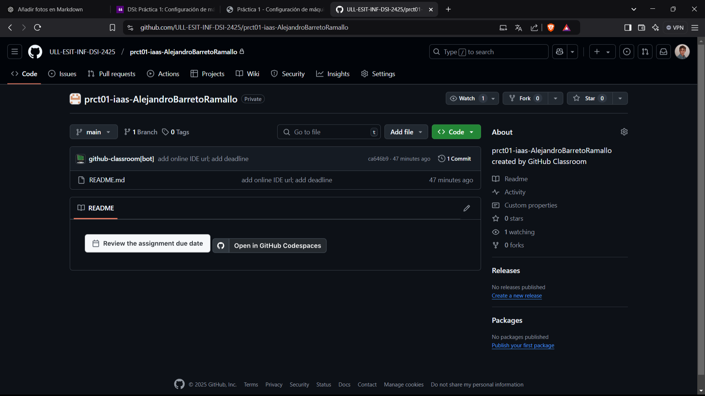
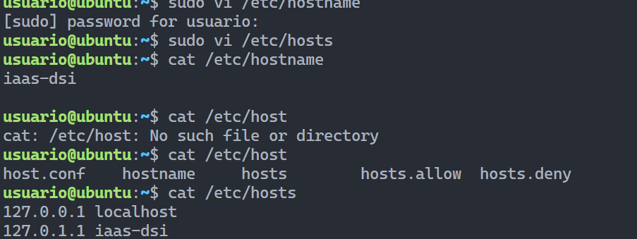

# Informe primera practica: configuracion de maquina virtual

## Tareas previas a la configuracion del iaas

### Realizacion de encuestas

- Realizamos la encuesta sobre espectativas de la asignatura

- Realizamos la encuesta para crear un grupo

### Aceptamos la tarea en el github clasroom

## Configuracion de la maquina

1. Acceso al servicio Iaas de la ull

2. Tomamos la maquina virtual y la encendemos

3. Introducimos usuario 2 veces y cambiamos la contraseña

4. Una vez accedemos con ssh, modificamos el nombre de host

5. Generamos la clave ssh en la maquina local

6. Generamos la clave ssh en la maquina virtual

7. Configuramos git

8. Instalamos Node
