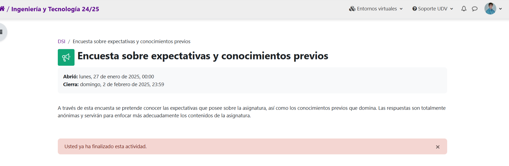
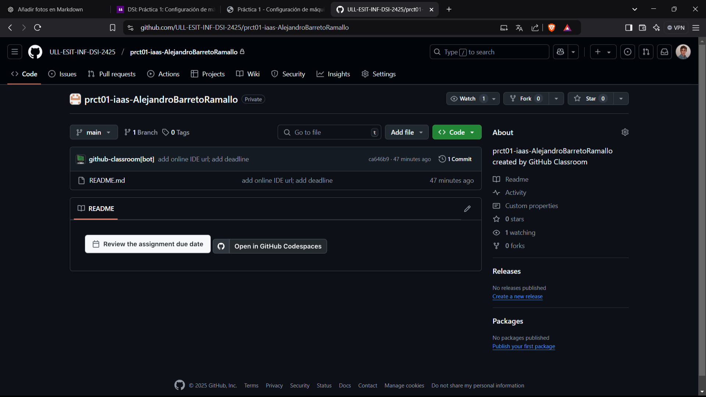
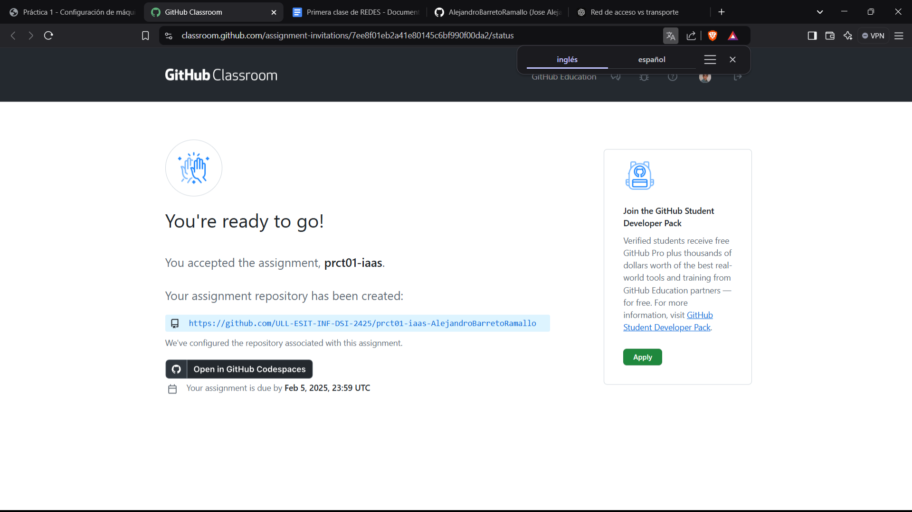
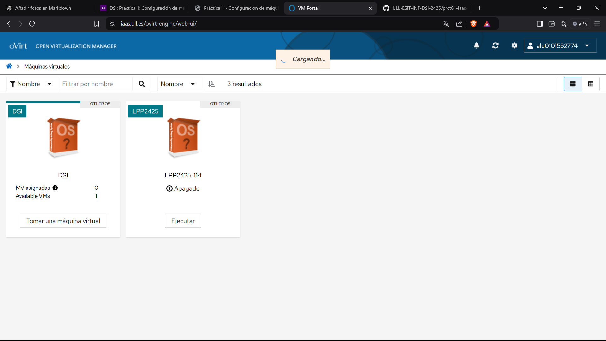
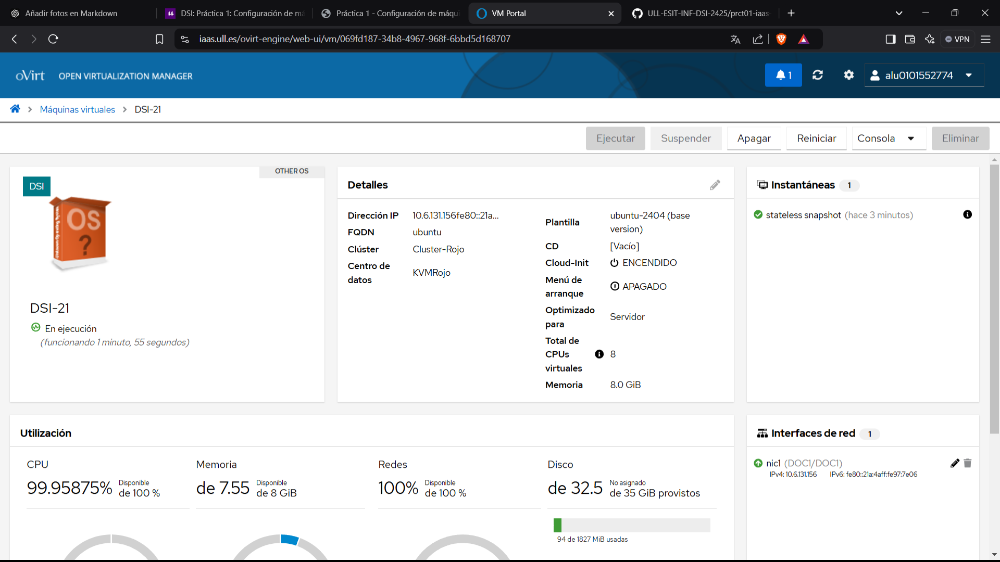
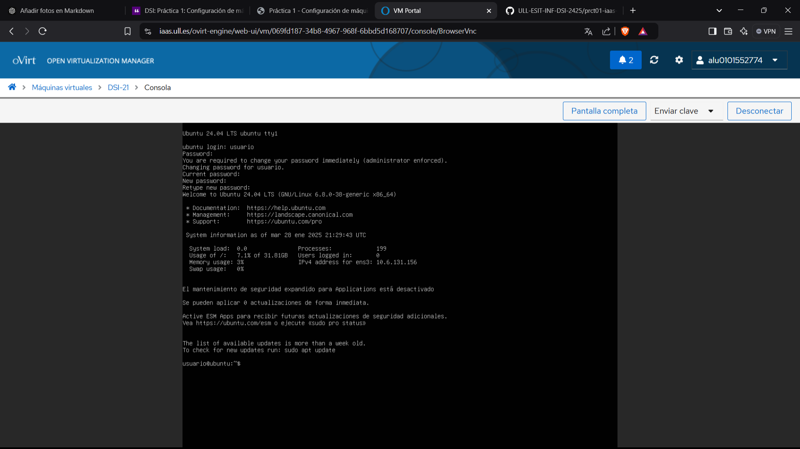
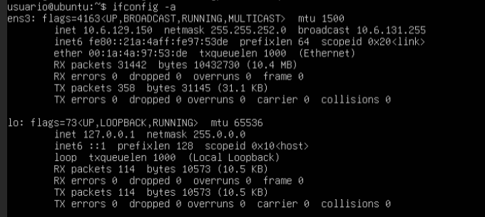

# Informe primera practica: configuracion de maquina virtual

## Tareas previas a la configuracion del iaas

### Realizacion de encuestas

- Realizamos la encuesta sobre espectativas de la asignatura

- Realizamos la encuesta para crear un grupo


### Aceptamos la tarea en el github clasroom


### Creacion de cuenta de github
En nuestro caso, ya disponemos de una cuenta de github
```
ale@Asusbarreto:~/DesarrolloSistemasInformaticos$ cat ../.gitconfig 
[user]
        email = alu0101552774@ull.edu.es
        name = AlejandroBarretoRamallo
        mail = alu0101552774@ull.edu.es
[credential]
        helper = cache
[push]
        default = matching
[branch]
        autosetuprebase = always
[init]
        defaultBranch = main
```
### Github Education
En nuestro caso ya hemos solicitado previamente para otras asignaturas
estos beneficios

### Aceptamos el Github classroom
Completamos la asignacion al classroom de github

### Introducción a makrdown
Los conocimientos basicos para poder desarrollar en markdonw son:
- #_Titulo nos permite crear titulos
- ##-###-###... para anidar niveles de 
- Utilizar guiones para listas no enumeradas
- Utilizar numeros(1. 2. 3.) para crear una lista enumerada
- Utilizar comillas (```) entre bloques de codigo
- Utilizar [] y parentesis() para añadir imagenes o enlaces
## Configuracion de la maquina

1. Acceso al servicio Iaas de la ull 

  

2. Tomamos la maquina virtual y la encendemos

  

3. Introducimos el nombre de usuario y a contraseña(usuarioen ambos casos) y cambiamos la contraseña por defecto a una nueva

  

4. Ahora debemos abrir la temrinal a traves de la consola VNC.
        Debemos instalar las net-tools y obtener la direccion de nuestra maquina 
        con los siguientes comandos: 

        ```
        sudo apt install net-tools
        ...
        ifconfig -a
        ```
        
        Al ejecutar con sudo, nos pedira la contraseña para poder ejecutar dicho comando

  

5. Una vez obtenemos la IP, podemos establecer una conexion ssh desde nuestra terminal de linux
        Ademas de pedirnos la contraseña, al ser la primera vez nos preguntara si queremos guardar este 
        host, y pondremos 'yes'

        ```
        ale@Asusbarreto:~$ ssh usuario@10.6.129.150
        The authenticity of host '10.6.129.150 (10.6.129.150)' can't be established.
        ED25519 key fingerprint is SHA256:ODy4ctkBDwulQhf8LRdj79LykH6poMMuOt/6EbWaCro.
        This host key is known by the following other names/addresses:
            ~/.ssh/known_hosts:1: [hashed name]
        Are you sure you want to continue connecting (yes/no/[fingerprint])? yes
        Warning: Permanently added '10.6.129.150' (ED25519) to the list of known hosts.
        usuario@10.6.129.150's password:
        Welcome to Ubuntu 24.04 LTS (GNU/Linux 6.8.0-52-generic x86_64)

         * Documentation:  https://help.ubuntu.com
         * Management:     https://landscape.canonical.com
         * Support:        https://ubuntu.com/pro

         System information as of sáb 01 feb 2025 17:13:21 UTC

          System load:  0.0               Processes:             193
          Usage of /:   8.3% of 31.81GB   Users logged in:       1
          Memory usage: 3%                IPv4 address for ens3: 10.6.129.150
          Swap usage:   0%

         * Strictly confined Kubernetes makes edge and IoT secure. Learn how MicroK8s
           just raised the bar for easy, resilient and secure K8s cluster deployment.

           https://ubuntu.com/engage/secure-kubernetes-at-the-edge

        El mantenimiento de seguridad expandido para Applications está desactivado

        Se pueden aplicar 193 actualizaciones de forma inmediata.
        Para ver estas actualizaciones adicionales, ejecute: apt list --upgradable

        Active ESM Apps para recibir futuras actualizaciones de seguridad adicionales.
        Vea https://ubuntu.com/esm o ejecute «sudo pro status»


        Last login: Mon Jul 15 12:20:52 2024 from 10.107.1.25
        ```

6. Modificamos el nombre de host de la máquina virtual

