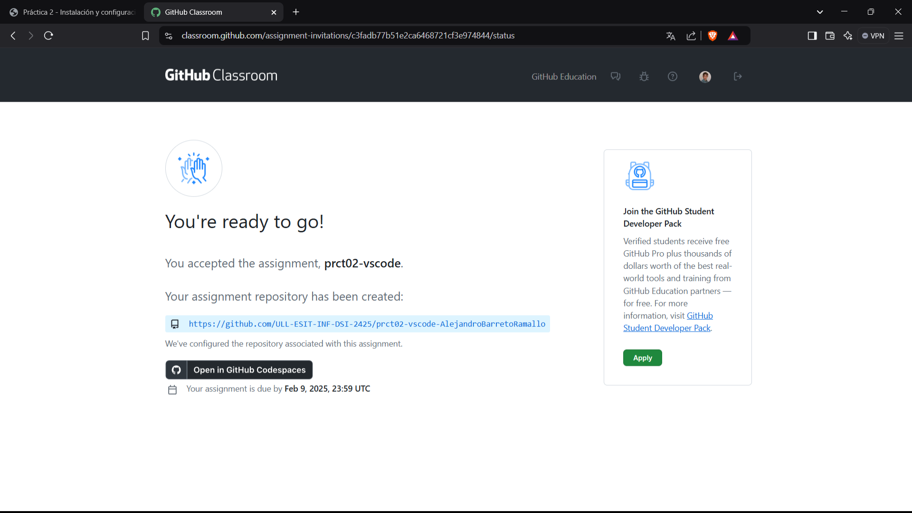
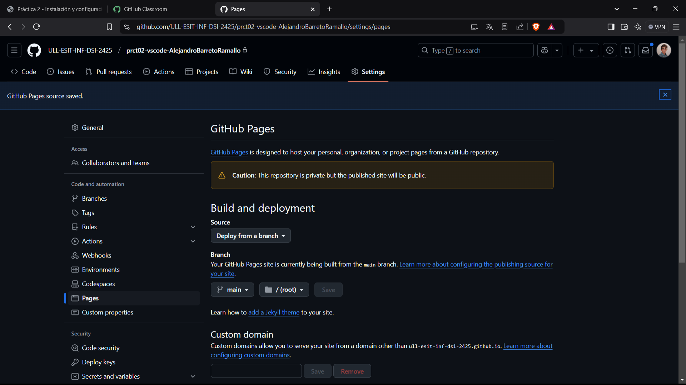

# Instaación y configuración de VSCode

## Tareas previas a la prática

- Aceptamos al tarea de github classroom


- Habilitamos github pages en el repositorio compartido



## Instalación de VSCode

- Utilizamos el comando snap para instalar el visual

  ```
  usuario@DSI:~~ $ sudo snap install code --classic
  2025-02-02T12:42:00Z INFO Waiting for automatic snapd restart...
  code cd4ee3b1 from Visual Studio Code (vscode✓) installed
  usuario@DSI:~~ $
  ```

- En mi caso, ya llevo bastante tiempo usando el Visual Studio Code, por 
  lo que ahora comenzaremos a configurar el visual en la máquina virtual

## Configuración de visual studio Code

- Como ya realizamos la práctica uno, ya somos capaces de acceder cómodamente
  a la máquina virtual a través del ssh. Aquí se puede observar todo el 
  proceso
  [Conexión ssh:](https://ull-esit-inf-dsi-2425.github.io/prct01-iaas-AlejandroBarretoRamallo/)

- 