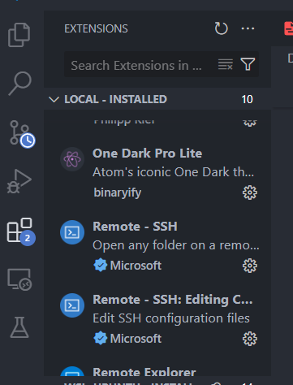
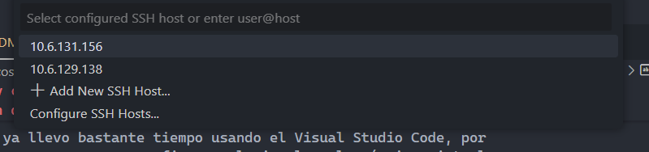
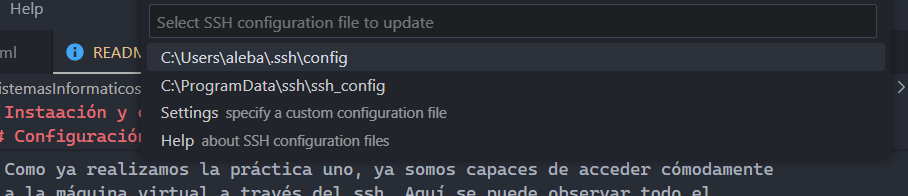
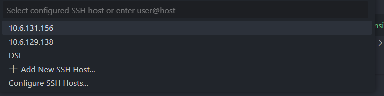
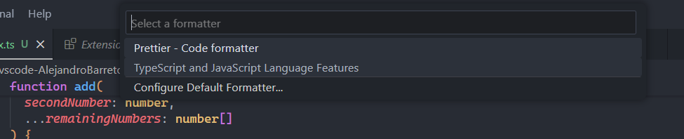

# Instaación y configuración de VSCode

## Tareas previas a la prática

- Aceptamos al tarea de github classroom


- Habilitamos github pages en el repositorio compartido


## Instalación de VSCode

- Utilizamos el comando snap para instalar el visual

  ```
  usuario@DSI:~~ $ sudo snap install code --classic
  2025-02-02T12:42:00Z INFO Waiting for automatic snapd restart...
  code cd4ee3b1 from Visual Studio Code (vscode✓) installed
  usuario@DSI:~~ $
  ```

- En mi caso, ya llevo bastante tiempo usando el Visual Studio Code, por 
  lo que ahora comenzaremos a configurar el visual en la máquina virtual

## Configuración de visual studio Code

- Como ya realizamos la práctica uno, ya somos capaces de acceder cómodamente
  a la máquina virtual a través del ssh. Aquí se puede observar todo el 
  proceso
  [Conexión ssh:](https://ull-esit-inf-dsi-2425.github.io/prct01-iaas-AlejandroBarretoRamallo/)

- A contunación, debemos de instalar una extension denominada remote-ssh para poder conectarnos a la máquina 
  del iaas desde el propio Visual. En mi caso ya tenia instalada dicha versión
  
  

- Ahora, como no nos apracee nuestra máquina, debemos configurar los hosts ssh a través del siguiente menu
  

- Elegimos la primera opción disponible
  

- Añadimos al archivo el host de nuestra máquina virtual poniendo lo siguiente, teniendo en cuenta que llamamos a nuestra
  máquina DSI

  ```
  Host DSI
    HostName DSI
    User usuario
  ```

- Ahora sale nuestra máquina dentro de los hosts y podemos conectarnos a ella
  

- Por ultimo comprobamos que en efecto estamos en la maquina virtual usanod la variable
  $hostname

  ```
  usuario@DSI:~~ $ echo $HOSTNAME
  DSI
  ```

## Habilitar sesiones colaborativas

- Debemos descargar la extensión de live share para poder editar un archivo junto  
  a otras personas a la vez
  

## Desarrollo del primer proyecto en typescript

1. Clonamos el repositorio en la mv

   ```
   usuario@DSI:~~ $ git clone git@github.com:ULL-ESIT-INF-DSI-2425/prct02-vscode-AlejandroBarretoRamallo.git
   Cloning into 'prct02-vscode-AlejandroBarretoRamallo'...
   remote: Enumerating objects: 3, done.
   remote: Counting objects: 100% (3/3), done.
   remote: Compressing objects: 100% (2/2), done.
   remote: Total 3 (delta 0), reused 0 (delta 0), pack-reused 0 (from 0)
   Receiving objects: 100% (3/3), done.
   ```

2. Creamos el directorio raíz del proyecto

   ```
   usuario@DSI:~/prct02-vscode-AlejandroBarretoRamallo~/prct02-vscode-AlejandroBarretoRamallo (main) $ mkdir theory-examples
   usuario@DSI:~/prct02-vscode-AlejandroBarretoRamallo~/prct02-vscode-AlejandroBarretoRamallo (main) $ cd theory-examples/
   usuario@DSI:~/prct02-vscode-AlejandroBarretoRamallo/theory-examples~/prct02-vscode-AlejandroBarretoRamallo/theory-examples (main) $ 
   ```

3. Generamos el fichero package.json

   ```
   ples (main) $ npm init --yes
   Wrote to /home/usuario/prct02-vscode-AlejandroBarretoRamallo/theory-examples/package.json:
   
   {
     "name": "theory-examples",
     "version": "1.0.0",
     "main": "index.js",
     "scripts": {
       "test": "echo \"Error: no test specified\" && exit 1"
     },
     "keywords": [],
     "author": "",
     "license": "ISC",
     "description": ""
   }
   ```

4. Instalamos el compilador y comrpobamos su version

   ```
   ples (main) $ npm i --global typescript

   added 1 package in 2s
   
   ples (main) $ tsc --version
   Version 5.7.3
   ```

5. Modifcamos la configuración del compilador

   ```
   ples (main) $ cat tsconfig.json 
   {
     "compilerOptions": {
       "target": "ES2024",
       "module": "commonjs",
       "rootDir": "./src",
       "outDir": "./dist"
     }
   }
   ```

6. Creamos os directorios dist y src, que son los qu ehemos especificado en 
   el tsconfig.json

   ```
   mples (main) $ mkdir src, dist
   usuario@DSI:~/prct02-vscode-AlejandroBarretoRamallo/theory-examples~/prct02-vscode-AlejandroBarretoRamallo/theory-examples (main) $ ls
   dist  package.json  src,  tsconfig.json
   ```

7. Ahora charemos que se compile y ejecute automáticamente cada vez que se detecten cambios 
   en el codigo fuente

   ```
   ples (main) $ npm install --save-dev tsc-watch
   
   added 19 packages, and audited 20 packages in 3s
   
   found 0 vulnerabilities
   ```

   Debemos modificar la clave scripts del fichero de package

   ```
   ples (main) $ cat package.json 
   {
     "name": "theory-examples",
     "version": "1.0.0",
     "main": "index.js",
     "scripts": {
       "start": "tsc-watch --onSuccess \"node dist/index.js\""
     },
     "keywords": [],
     "author": "",
     "license": "ISC",
     "description": "",
     "devDependencies": {
       "tsc-watch": "^6.2.1"
     }
   }
   ```

8. Creamos el fichero con código fuente en index.ts

   ```
   examples/src (main) $ cat index.ts 
   const myString: string = "Hola Mundo";
   console.log(myString);
   ```

9. Ahora debemos ejecutar la parte de start que se encunetra en scripts de package.json

   ```
   17:14:31 - Starting compilation in watch mode...
   
   
   17:14:33 - Found 0 errors. Watching for file changes.
   Hola Mundo
   ```

10. Ahora podemos hacer un diff para comprobar las fierencias entre typescript y el codigo transformaod a javascript
    
    ```
    examples/src (main) $ diff index.ts ../dist/index.js 
    1,2c1,2
    < const myString: string = "Hola Mundo";
    < console.log(myString);
    \ No newline at end of file
    ---
    > const myString = "Hola Mundo";
    > console.log(myString);
    ```

11. Para mejorar la búsqueda y solución de errores instalaremos un Linter, en 
    nuestro caso ESlint

    ```
    examples/src (main) $ npm i -g eslint
    
    added 85 packages in 4s
    
    22 packages are looking for funding
      run `npm fund` for details
    
    examples/src (main) $ eslint --version
    v9.19.0
    ```

12. Creamos el ficheor de configuracion de eslint

    ```
    ples (main) $ eslint --init
    You can also run this command directly using 'npm init @eslint/config@latest'.
    
    > theory-examples@1.0.0 npx
    > create-config
    
    @eslint/create-config: v1.4.0
    
    ✔ How would you like to use ESLint? · problems
    ✔ What type of modules does your project use? · esm
    ✔ Which framework does your project use? · none
    ✔ Does your project use TypeScript? · typescript
    ✔ Where does your code run? · node
    The config that you've selected requires the following dependencies:
    
    eslint, globals, @eslint/js, typescript-eslint
    ✔ Would you like to install them now? · No / Yes
    ✔ Which package manager do you want to use? · npm
    ☕️Installing...
    
    added 110 packages, and audited 130 packages in 9s
    
    36 packages are looking for funding
      run `npm fund` for details
    
    found 0 vulnerabilities
    Successfully created /home/usuario/prct02-vscode-AlejandroBarretoRamallo/theory-examples/eslint.config.mjs file.
    ```

13. Ahora debemos de tener un fcihero con la configuracion de eslint

    ```
    ples (main) $ cat eslint.config.mjs 
    import globals from "globals";
    import pluginJs from "@eslint/js";
    import tseslint from "typescript-eslint";
    
    
    /** @type {import('eslint').Linter.Config[]} */
    export default [
      {files: ["**/*.{js,mjs,cjs,ts}"]},
      {languageOptions: { globals: globals.node }},
      pluginJs.configs.recommended,
      ...tseslint.configs.recommended,
    ];
    ```

14. Si ahora modificamos el index.ts y no usamos la variabe,
    eslint nos lo marcará como error por asignar valores  a
    una variable que no se usa

    ```
    amples (main) $ cat src/index.ts 
    const myString: string = "Hola Mundo";
    console.log(myString);

    etoRamallo/theory-examples (main) $ eslint .

    /home/usuario/prct02-vscode-AlejandroBarretoRamallo/theory-examples/dist/index.js
      1:7  error  'myString' is assigned a value but never used  @typescript-eslint/no-unused-vars
    
    ✖ 1 problem (1 error, 0 warnings)
    ```

15. Si quereos desactivar esta regla, podemos desactivarla modifcando la
    condifugración de eslint.Para ello debemos en una clave rules, indicar la clave y ponerla off

    ```
    import globals from "globals";
    import pluginJs from "@eslint/js";
    import tseslint from "typescript-eslint";
    
    
    /** @type {import('eslint').Linter.Config[]} */
    export default [
      {files: ["**/*.{js,mjs,cjs,ts}"]},
      {languageOptions: { globals: globals.node }},
      pluginJs.configs.recommended,
      ...tseslint.configs.recommended,
      {rules: {
        "@typescript-eslint/no-unused-vars": "off"
      }},
    ];
    ```

    Otra opción es activar la regla pero si se incumple que nos salte un warning
    en vez de como problema, estableciendo la regla como warn

    ```
    {rules: {
      "@typescript-eslint/no-unused-vars": "warn"
    }},
    ```

    Ahora al ejecutar nos debería de salir como una advertencia

    ```
    ples (main) $ eslint .

    /home/usuario/prct02-vscode-AlejandroBarretoRamallo/theory-examples/dist/index.js
      1:7  warning  'myString' is assigned a value but never used  @typescript-eslint/no-unused-vars
    
    ✖ 1 problem (0 errors, 1 warning)
    ```

16. Si quisieramos añadir alguna regla que no este dentro de las recomendadas, también podríamos
    hacerlo modificando el mismo fichero.Supongamos por ejemplo la regla que obliga a inicializar variables

    ```
    {rules: {
      "@typescript-eslint/no-unused-vars": "warn",
      "init-declarations": "off",
      "@typescript-eslint/init-declarations": "error"
    }},
    ```
    Si ahora modificamos el fichero fuente y no inicializamos la variable

    ```
    let myString: string;
    console.log(myString);
    ```

    Ahora nos dará otro error

    ```
    ples (main) $ eslint .

    /home/usuario/prct02-vscode-AlejandroBarretoRamallo/theory-examples/dist/index.js
      1:7  warning  'myString' is assigned a value but never used  @typescript-eslint/no-unused-vars
    
    /home/usuario/prct02-vscode-AlejandroBarretoRamallo/theory-examples/src/index.ts
      1:5  error  Variable 'myString' should be initialized on declaration  @typescript-eslint/init-declarations
    
    ✖ 2 problems (1 error, 1 warning)
    ```

17. Otra cosa que podemos especificar son aquellos ficheros que no queremos que eslint compruebe, por ejemlo
    el codigo en js de /dist

    ```
    import globals from "globals";
    import pluginJs from "@eslint/js";
    import tseslint from "typescript-eslint";
    
    
    /** @type {import('eslint').Linter.Config[]} */
    export default [
      {files: ["**/*.{js,mjs,cjs,ts}"]},
      {languageOptions: { globals: globals.node }},
      pluginJs.configs.recommended,
      ...tseslint.configs.recommended,
      {rules: {
        "init-declarations": "off",
        "@typescript-eslint/init-declarations": "error"
      }},
      {ignores: [
        "dist/*"
      ]    
      }
    ];
    ```

    Con el * lo que estamos indicando que no queremos que compruebe ningun arhcivo que se
    encuentre en ese directorio

18. Ahora dejamos el código fuente como estaba originalmente y dejamos las reglas recomendadas 

## Formateador de código Prettier

- Instalamos dos paquetes de Prettier, el nomrmal, y el que quita las reglas
  de formato de elsinter para que ambas herramientas puedan estar usandose a la vez

  ```
  ples (main) $ npm i --save-dev prettier eslint-config-prettier
  
  added 2 packages, and audited 132 packages in 2s
  
  37 packages are looking for funding
    run `npm fund` for details
  
  found 0 vulnerabilities
  ```

- Modificamos al configuracion de eslint para importar el modulo del segundo paquete descargado
  añadiendo esta linea debajo el ultimo import 

  ```
  import eslintConfigPrettier from "eslint-config-prettier";
  ```

  Dentro del default debemos añadir lo siguiente

  ```
  eslintConfigPrettier,
  ```

- Ahora debemos de crear un fichero de configuración de Prettier

  ```
  ples (main) $ echo {} > .prettierrc
  ```

- Crearemos también un fichero para especificar que archivos deben ser ignorados

  ```
  ples (main) $ cat .prettierignore 
  dist
  node_modules
  .prettierrc
  .eslint.config.mjs
  package-lock.json
  package.json
  tsconfig.json
  ```

- Modificamos index.ts y ponemos lo siguiente

  ```
  function add(firstNumber: number, secondNumber: number, ...remainingNumbers: number[]) {
    let result = firstNumber + secondNumber;
    if (remainingNumbers.length) {
      result += remainingNumbers.reduce((prev, current) => prev + current);
    }
    return result; 
  }
  
  console.log(add(1, 2));
  console.log(add(1, 2, 3));
  console.log(add(1, 2, 4));
  ```

- Ahora ejecutamos prettier para que formatee el código 

  ```
  /theory-examples (main) $ npx prettier --write 
  eslint.config.mjs 93ms
  src/index.ts 90ms
  ```

- Ahora el código ha sido formateado y se ve de la siguiente forma:

  ```
  ples (main) $ cat src/index.ts 
  function add(
    firstNumber: number,
    secondNumber: number,
    ...remainingNumbers: number[]
  ) {
    let result = firstNumber + secondNumber;
    if (remainingNumbers.length) {
      result += remainingNumbers.reduce((prev, current) => prev + current);
    }
    return result;
  }
  
  console.log(add(1, 2));
  console.log(add(1, 2, 3));
  console.log(add(1, 2, 4));
  ```

- Instalamos la extensión de Prettier en visual
  

- Establecemos prettier como opción de formateo de código
  